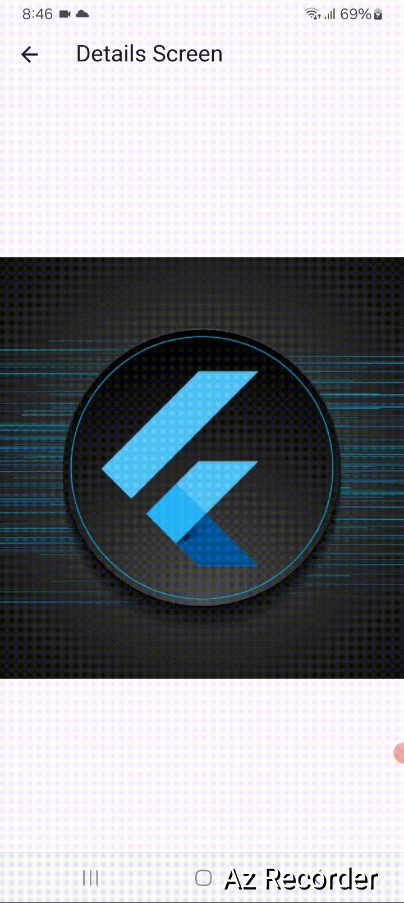

# Hero Animation Example with Flutter Dart
  
  ## Interactive Hero Animation Demo 
This project demonstrates how to use the Hero Animation in Flutter to transition between two screens seamlessly.

## Features
* **Showcase Flutter's Hero animation for image transitions across screens.:**  Showcase Flutter's Hero animation for image transitions across screens.


<p float="left">
 

</p>

 

## Run Locally

Clone the project

```bash
  git clone git@github.com:abdulawalarif/image_animation_with_hero.git
```

Go to the project directory

```bash
  cd image_animation_with_hero
```

Install dependencies

```bash
  flutter pub get
```

Connect a physical device or start a virtual device on your machine

```bash
  flutter run
```

## Customization Tips
- Hero Tag Customization: Modify the tag property in the Hero widget to create unique animations for different elements.
- Image Asset Replacement: Replace the assets/bag.jpg with your own image in the assets folder and update the pubspec.yaml accordingly.
- Size Adjustments: Change the height and width properties in Image.asset to adapt to different screen sizes or design requirements.

## Reporting Bugs or Requesting Features?

If you found an issue or would like to submit an improvement to this project,
please submit an issue using the issues tab above. If you would like to submit a PR with a fix, reference the issue you created!

 
## Author

- [@abdulawalarif](https://github.com/abdulawalarif) 
  
## License

[MIT](https://choosealicense.com/licenses/mit/)